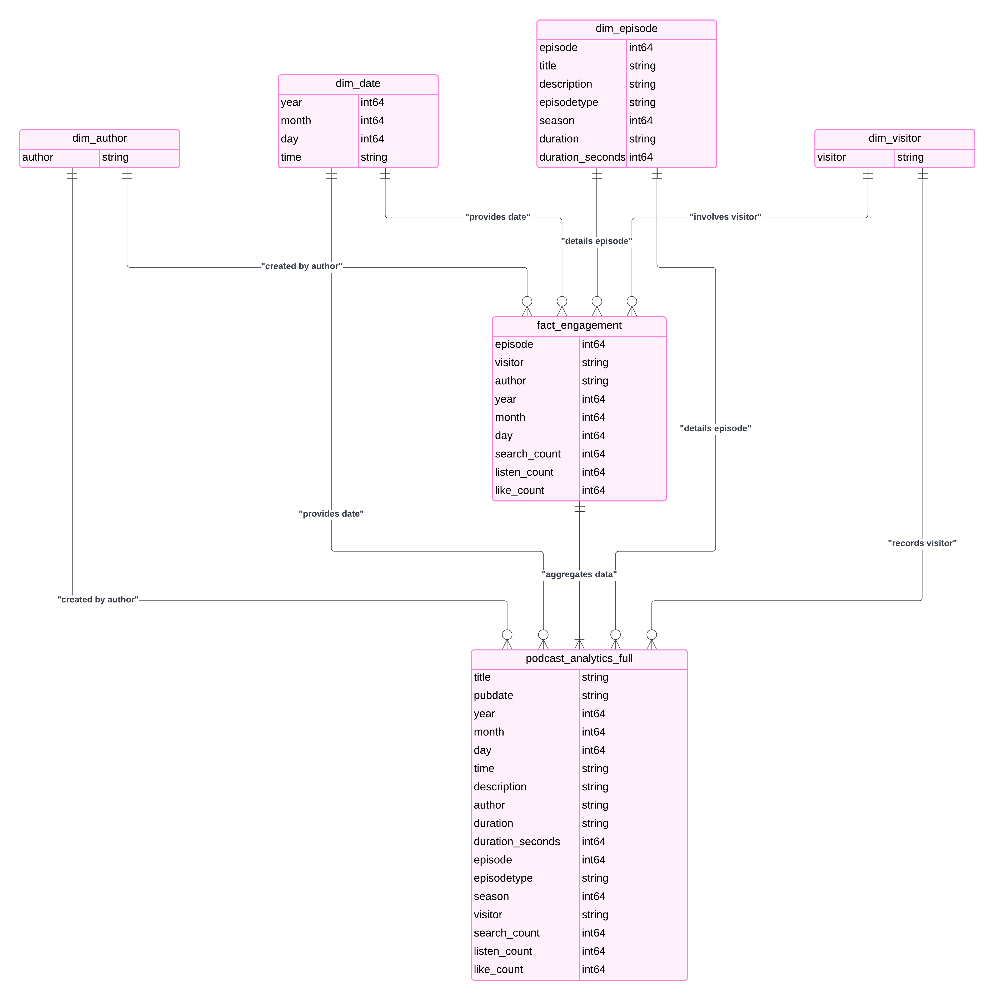

# Mamramic Podcasts Analytics Pipeline

**Description:**

This project implements an end-to-end analytics pipeline for Spotify podcasts, specifically focusing on the "Mamramic" podcast series. The goal is to provide actionable insights into podcast performance, user behavior, and content optimization opportunities. The pipeline automates data ingestion, transformation, and analysis, enabling the Mamramic team to make data-driven decisions about their content strategy.

**Key Objectives:**

*   **Performance Monitoring:** Track and analyze the performance of Mamramic podcasts, including listenership, likes, searches and more granular metrics like hourly views.
*   **User Behavior Analysis:**  Understand how users engage with the podcasts, including listening patterns, search queries, and interactions.
*   **Content Optimization:** Identify areas for content improvement and guide future podcast production by analyzing what works well.
*   **Trend Identification:** Uncover emerging trends in listener behavior and content consumption.
*   **Data-Driven Storytelling:** Explore what types of podcast structure and content are more conducive to likes, shares and listener retention,
*   **Standardized and Automated Data Flow:** Establish a repeatable and automated pipeline to move from raw to analytical ready data.

**Architecture:**

The pipeline is built on a three-layer AWS architecture:

*   **Raw (Bronze) Layer:** Stores raw podcast data ingested from various sources (XML feeds for metadata, ZIP archives with event logs, MP3 audio files for analysis). This uses Amazon S3.
*   **Staging (Silver) Layer:** Contains data that has undergone partial transformation and cleaning, ready for further processing. We store those files in Parquet format in Amazon S3.
*   **Curated (Gold) Layer:** Stores clean, aggregated, and analytics-ready data which can be consumed for visualization and business intelligence, including Amazon Redshift as a DW.

  
  

**Tools and Technologies:**

*   **Orchestration:** Apache Airflow is used to schedule and manage the data pipeline workflows, running inside a Docker container.
*   **Data Processing:** Python with pandas, boto3, pyarrow, ffmpeg, and nltk libraries is used for data manipulation, transformation, and feature extraction.
*   **Storage:** Amazon S3 is used for storing raw, processed, and analytical-ready data.
*   **Data Lakehouse:**  Utilizes a mix of Amazon Redshift and S3 as part of the data lakehouse.
*   **Data Catalog:** AWS Glue is used to create and maintain a metadata catalog.
*   **Visualization:** Supports several visualizations using AWS QuickSight, GCP Looker, and general analysis using pandas and Amazon Athena

**Key Features:**

*   **Automated Data Ingestion:**  Fetches podcast metadata, user logs, and audio files from source and loads them to S3 Bronze layer.
*   **Podcast Data Processing:** Includes data transformations like:
    * Standardizing timestamps
    * Extracting episode IDs and details from XML feeds
    * Cleaning textual data (episode names, descriptions)
    * Validating the data against its schema.
   *  Processing logs, grouping and counting the various events
   *  Merging and joining all the processed data to create a structured model.
*   **Audio Processing:** Leverages `ffmpeg` to validate audio file duration and quality, generating quality reports.
*   **Data Quality Checks:** Includes automated checks for null values, unique identifiers, valid date formats, and data range constraints.
*   **Data Cataloging:**  Uses AWS Glue to discover and catalog tables in S3, facilitating querying with Athena and Spectrum.
*   **Analytics Dashboard Support:** Exports the data to be consumed by visualization platforms (AWS QuickSight, GCP Looker, general analysis).
*   **Visualization:** Contains several dashboards that analyzes listeners behavior.

**Data Model:**

The data model consists of:
*   `dim_episode`:  Dimension table containing podcast episode details such as title, description, and duration.
*   `dim_date`: Dimension table containing timestamps details.
*   `dim_author`: Dimension table with the podcasts authors.
*   `dim_visitor`: Dimension table with details about the users listening to the podcasts.
*  `fact_engagement`: Fact table with granular data about the different events, and how they relates to episodes and visitors.
* `podcast_analytics_full` : The main fact table used in the analysis that aggregates all the different sources.

**Project Status:**

The project is currently under development and will be continuously improved with new features and capabilities.

**Getting Started:**

1.  Clone the repository.
2.  Configure your AWS credentials.
3.  Build the Docker image.
4.  Run the Airflow containers.
5.  Create necessary S3 buckets.
6.  Run the Airflow DAG to start the pipeline.
